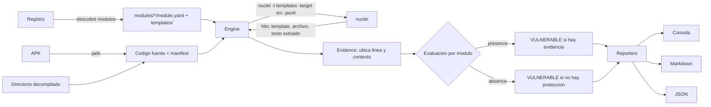

# apkscan

Herramienta de línea de comandos que analiza un APK (o el código ya decompilado) y busca evidencia de vulnerabilidades del OWASP MASTG. La detección la hacen templates de nuclei y Python se ocupa de orquestar, ubicar la evidencia y armar el reporte.

Hecha para el challenge técnico de Tungstenic.

## Qué detecta

| Test | MASWE | Qué busca | Tipo |
|---|---|---|---|
| MASTG-TEST-0221 | MASWE-0007 | Algoritmos simétricos rotos: DES, 3DES, RC2, RC4, Blowfish | presencia |
| MASTG-TEST-0232 | MASWE-0007 | Modo ECB, explícito (`AES/ECB/...`) o implícito (`Cipher.getInstance("AES")`) | presencia |
| MASTG-TEST-0212 | MASWE-0003 | Claves hardcodeadas en `SecretKeySpec` (arreglo de bytes, string o Base64 literal) | presencia |
| MASTG-TEST-0291 | MASWE-0038 | Falta de `FLAG_SECURE` para evitar capturas de pantalla | **ausencia** |

## Requisitos

- Python 3.10 o superior y `pip install -r requirements.txt` (solo PyYAML)
- [nuclei](https://github.com/projectdiscovery/nuclei) en el PATH
- [jadx](https://github.com/skylot/jadx) y Java, solo si el input es un `.apk`

Si los binarios no están en el PATH se pueden pasar con `--nuclei` y `--jadx`, o con las variables `NUCLEI_BIN` y `JADX_BIN`.

## Uso

```bash
python -m apkscan app.apk
python -m apkscan app.apk --md reporte.md --json reporte.json
python -m apkscan ./app-decompilada
python -m apkscan app.apk --only 0221 0232
python -m apkscan app.apk --skip 0291
python -m apkscan --list-modules
```

Si el input es un `.apk`, se decompila con jadx en `.apkscan-work/<nombre>` y se reutiliza en las corridas siguientes (`--force` para volver a decompilar). Si es un directorio, se analiza tal cual; espera la estructura de jadx (`sources/` y `resources/AndroidManifest.xml`).

El código de salida es `1` si algún test resulta vulnerable, `0` si no y `2` ante un error de ejecución, así que se puede usar en un pipeline.

## Qué muestra el reporte

Por cada test: título, descripción, evidencias, impacto y mitigación. Cada evidencia incluye archivo, línea y el fragmento de código con dos líneas de contexto, marcando la línea que disparó la regla:

```
[VULNERABLE] MASTG-TEST-0221 / MASWE-0007 / MASVS-CRYPTO  (severidad: Alta)
Evidencias (2):
  #1 [uso inseguro] sources/com/example/vault/WeakCrypto.java:14
     regla: Algoritmo simetrico roto en Cipher, KeyGenerator o SecretKeyFactory
         12 |         DESKeySpec keySpec = new DESKeySpec(raw);
         13 |         SecretKeyFactory factory = SecretKeyFactory.getInstance("DES");
       > 14 |         Key key = factory.generateSecret(keySpec);
```

La salida de consola se puede complementar con un reporte en Markdown (`--md`) o JSON (`--json`).

## El caso de MASWE-0038: la evidencia es que no hay evidencia

Para FLAG_SECURE el test falla cuando la API **no aparece**. Un "0 resultados" a secas no le sirve a nadie, así que el módulo declara `mode: absence` y el reporte demuestra la ausencia con datos verificables:

- los patrones exactos que se buscaron,
- cuántos archivos de código se analizaron,
- las activities declaradas en el `AndroidManifest.xml`, que son la superficie que queda sin protección,
- el resultado: 0 coincidencias.

Los estados posibles en un módulo de ausencia son:

| Situación | Estado |
|---|---|
| No hay ninguna referencia a la protección | `VULNERABLE` con evidencia por ausencia |
| Hay protección y nada la quita | `PROTEGIDO` (se muestran dónde se aplica) |
| Hay protección pero también un `clearFlags(FLAG_SECURE)` | `REVISAR` |

Haber encontrado `FLAG_SECURE` no prueba que todas las pantallas estén cubiertas. El test del MASTG pide revisar la consistencia, por eso el reporte lo avisa y deja esa validación manual.

jadx reemplaza la constante por su valor, así que `FLAG_SECURE` aparece como `8192` en el código decompilado. Los templates reconocen ambas formas.

## Arquitectura



Módulos de Python:

| Archivo | Responsabilidad |
|---|---|
| `cli.py` | argumentos, flujo general y código de salida |
| `registry.py` | descubre y valida los módulos |
| `decompile.py` | invoca jadx |
| `nuclei.py` | ejecuta nuclei y parsea su salida JSONL |
| `evidence.py` | convierte lo que devuelve nuclei en archivo, línea y contexto |
| `engine.py` | orquesta todo y decide el estado de cada módulo |
| `manifest.py` | lee las activities del `AndroidManifest.xml` |
| `reporters/` | salida en consola, Markdown y JSON |

nuclei no informa la línea en que matcheó un template de archivos. Por eso cada template tiene un extractor que devuelve el texto exacto encontrado y `evidence.py` lo ubica en el archivo para calcular la línea.

## Cómo agregar o quitar detecciones

Cada test es una carpeta en `apkscan/modules/`. El núcleo no conoce ningún módulo en particular: los descubre al iniciar.

```
modules/mastg_test_0221/
  module.yaml        # título, descripción, impacto, mitigación, severidad, modo
  templates/
    weak-algorithm.yaml   # templates de nuclei (protocolo file)
    des-keyspec.yaml
```

- **Agregar** un test: crear una carpeta con un `module.yaml` y al menos un template. No hay que tocar código Python. También se pueden cargar módulos externos con `--modules-dir`.
- **Quitar** un test: borrar la carpeta, poner `enabled: false` en su `module.yaml`, o excluirlo en una corrida con `--skip`.
- **Mejorar** una detección: editar el template de nuclei.
- **Rol de cada template**, según el tag de nuclei: sin tag es un indicador de uso inseguro; `role-protection` marca evidencia de que la protección existe; `role-weakening` marca código que la quita. Los dos últimos son los que permiten modelar tests de ausencia.

El registro valida los módulos al cargarlos y falla con un mensaje claro si falta un campo, si un id de template está repetido o si un módulo de ausencia no tiene templates de protección.

Hay más diagramas (flujo de una corrida, estructura de un módulo, decisión de estados y prueba dinámica) en [docs/arquitectura.md](docs/arquitectura.md).

## Prueba dinámica (opcional)

Solo MASTG-TEST-0291 admite verificación en runtime, los otros tres tests del alcance son estáticos. Con un emulador (Android Studio o Genymotion) o un dispositivo físico conectado por adb:

```bash
python -m apkscan app.apk --dynamic --install
python -m apkscan app.apk --dynamic --serial emulator-5554 --settle 3
```

Para cada activity del manifest la herramienta:

1. la abre con `am start -W`,
2. lee con `dumpsys window` las flags de la ventana que tiene el foco y busca `FLAG_SECURE`,
3. toma una captura con `screencap` y decodifica el PNG para ver si quedó en negro, que es lo que hace Android cuando la ventana es segura.

Cada activity queda como `protegida`, `SIN proteccion` u `omitida`. Se omiten las que no se pueden abrir desde adb, por ejemplo las no exportadas en un dispositivo sin root, y las que no llegan a tomar el foco. Si el resultado dinámico contradice al estático, el estado pasa a `REVISAR` y el reporte explica por qué.

Necesita `adb` en el PATH (o `--adb` / `ADB_BIN`). Sin `--install` la app tiene que estar ya instalada en el dispositivo.

## Tests

```bash
python -m unittest discover -s tests -t .
```

Los tests corren contra código de ejemplo en `tests/fixtures` y usan `tests/nuclei_sim.py`, un intérprete mínimo de los templates (matchers y extractors regex) que reemplaza al binario de nuclei. Sirve para probar el pipeline y las regex sin instalar nada, pero no reemplaza una corrida con nuclei real. La parte dinámica se prueba con un adb simulado y PNG generados en el test.

## Limitaciones

- Analiza código Java/Kotlin. Si el input es un directorio decompilado con apktool (smali), los templates actuales no aplican.
- Es análisis estático por regex, sin flujo de datos. Las claves hardcodeadas se detectan por patrones conocidos: un arreglo de bytes literal o un string de largo típico de clave en el mismo archivo que una `SecretKeySpec`. Claves armadas en varios pasos o ofuscadas pueden pasar desapercibidas, y algún literal del mismo largo puede dar un falso positivo. Por eso cada reporte incluye una nota de validación manual.
- nuclei omite por defecto los archivos de más de 1 MB.
- La prueba dinámica depende del formato de `dumpsys window`, que varía entre versiones de Android; se contemplan las flags con nombre (`SECURE`) y en hexadecimal. Solo cubre MASTG-TEST-0291.
