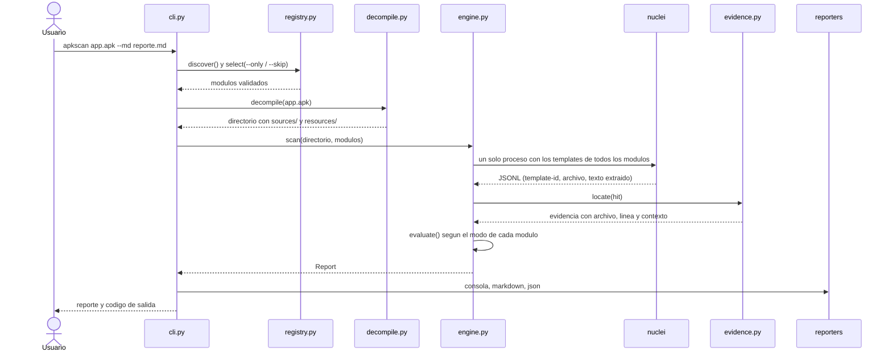
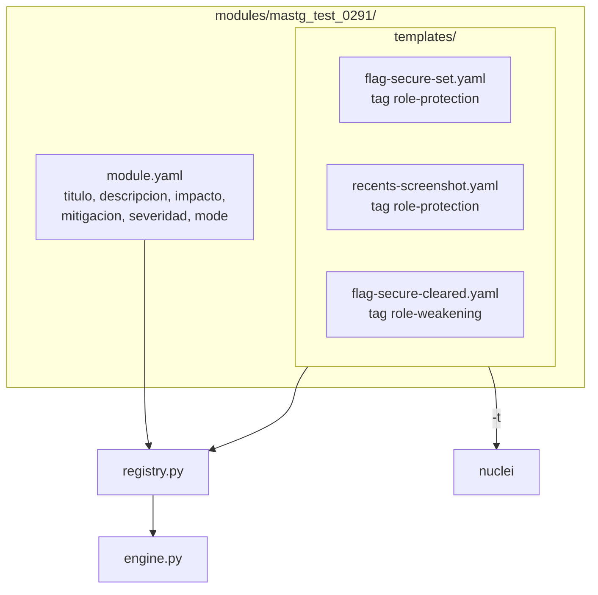
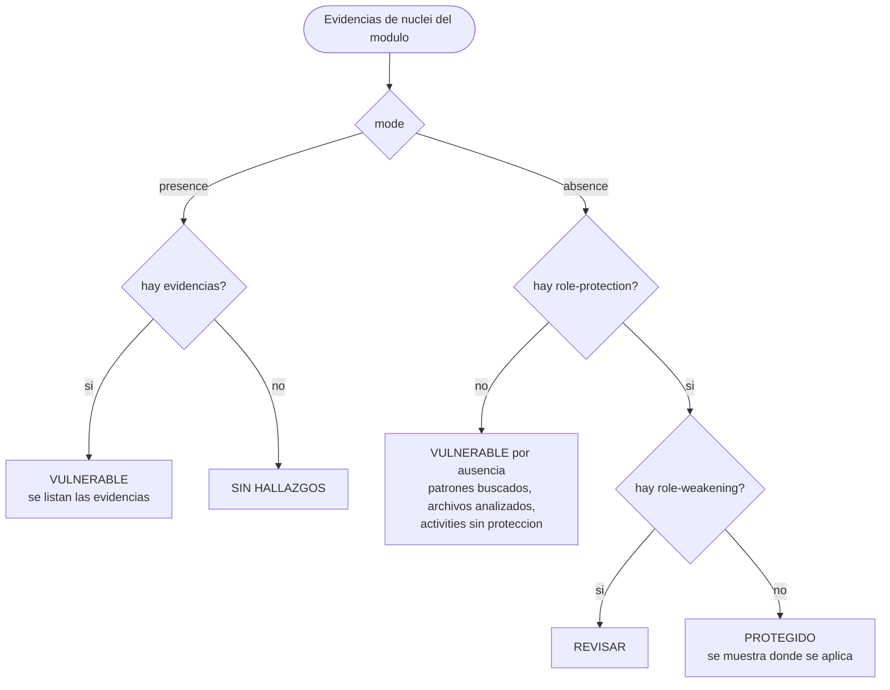
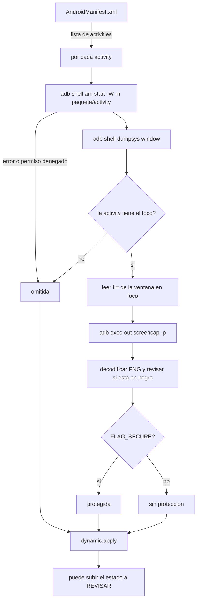

# Diagramas

Los diagramas están en Mermaid

## Flujo de una ejecucion

## Estructura de un módulo

El motor no tiene referencias a ningún test concreto. 
Todo lo que cambia entre un test y otro vive en la carpeta del módulo.

## Cómo se decide el estado

## Prueba dinámica (MASTG-TEST-0291)

Cuando la prueba dinámica contradice al análisis estático, el estado pasa a `REVISAR` y se deja una nota explicando el motivo.
